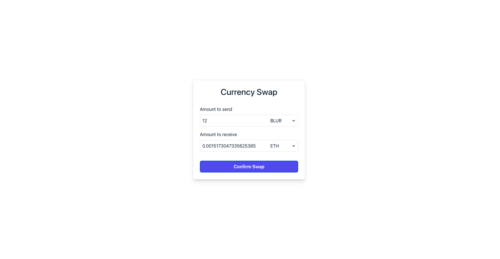

# Introduction

This project is an application with a fancy form. It help users able to swap currency.

## Setup

### Install dependency

```
yarn
```

### Start application in development mode

```
yarn dev
```

### Run test

```
yarn test --watch
```

### Run test coverage

```
yarn test --coverage
```

### Build

```
yarn build
```

### Preview application in production mode

```
yarn preview
```

## Interface

This is the interface of application:

